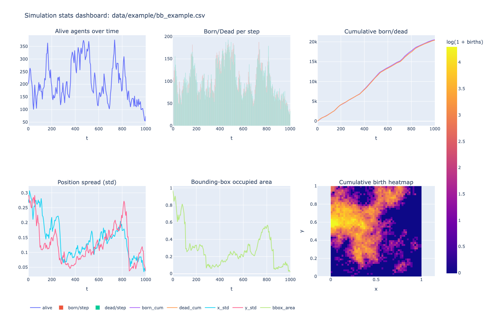
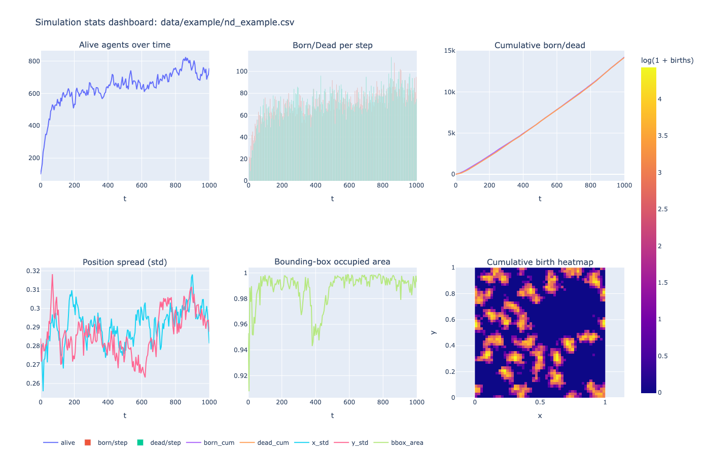
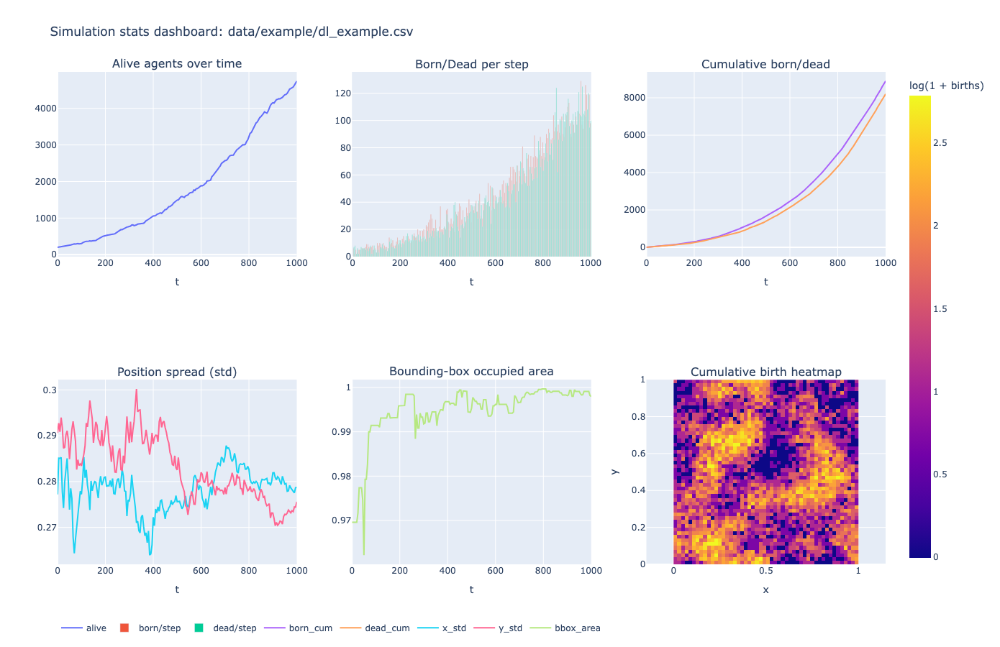

<p align="center">
  <a href="README_en.md">🇬🇧 English</a> |
  <a href="README_ru.md">🇷🇺 Русский</a> |
  <a href="README_de.md">🇩🇪 Deutsch</a> |
  <a href="README_ja.md">🇯🇵 日本語</a> 
</p>

# Пространственные модели популяционной динамики
### Имплементация и сравнительный анализ моделей броуновских жуков, neighborhood-dependent и Дикманна-Лоу


---
### О проекте

Данный репозиторий содержит программную реализацию и сравнительный анализ трёх **простраственных стохастических моделей популяции**: модель **броуновских жуков (BB)**, **neighborhood-dependent (ND)** модель и **модель Дикманна-Лоу (DL)**.

Проект состредоточен на **численной симуляции**, **формировании пространственных паттернов** и **анализе популяционной динамики**, при этом особое внимание уделяется различиям между механизмами взаймодействия с резким отсечением и на основе ядра.

---
### Цели исследования

Цели заключаются в **реализации** пространственных стохастических моделей динамики популяций, **сравнении** механизма взаимодействия «жесткого соседства» в модели ND с ядром «плавной конкуренции» в модели DL, а также в **анализе** процессов кластеризации, механизмов вымирания и критических режимов.

---
### Описание моделей

#### Модель броуновских жуков (BB)
- Особи перемещаются по принципу броуновского движения,
- Постоянные коэффициенты рождаемости и смертности: $\lambda = \text{const} \quad \mu = \text{const}$,

- Отсутствие взаимодействия между особями.

#### Модель neighborhood-dependent (ND)
- Броуновское движение с локальным взаимодействием,
- Коэффициент рождаемости зависит от числа соседей: $\lambda_i = \lambda_0 - \frac{1}{N_s} N_R^{(i)}$,
- Радиус жесткого взаимодействия $R$.

#### Модель Дикманна-Лоу (DL)
- Особи **фиксированы в пространстве (не перемещаются)**,
- Взаимодействие посредством непрерывного ядра: $d_i = d_0 + \alpha C_i$, где $C_i = \sum_j \exp\left(-\frac{r_{ij}^2}{2R_c^2}\right)$,
- Потомство распределено локально: $x_{\text{child}} = x_i + \xi, \quad \xi \sim \mathcal{N}(0, \sigma^2)$.

---
### Визуализация
Интерактивная визуализация реализована с помощью библиотеки Python **Plotly**. Кроме того, Plotly используется для построения графиков изменения численности популяции во времени, динамики рождаемости и смертности, кумулятивных данных, а также накопленной тепловой карты событий рождаемости.

Примеры дашбордов для моделирования в папке `data/example`:





---

### Инструкции по сборке

**Сборка проекта:**
```bash
mkdir build
cd build
cmake ..
make
```

**Прогон симуляций:**
```bash
./spatial_models bb
./spatial_models nd
./spatial_models dl
```

**Визуализация:**
```bash
python scripts/plot_dashboard.py data/output/dl_output.csv
```
---
### Список литературы

- Dieckmann, U. & Law, R. (1996) *The dynamical theory of coevolution*.
- Hernández-García, E., & López, C. (2004) *Clustering, advection, and patterns in population dynamics*.
- Law, R., & Dieckmann, U. (2000) *Plant community spatial models*.

---
### Лицензия

Данный проект предназначен исключительно для академического и образовательного использования.

Подробности см. в файле `LICENSE`.

---
### Статус проекта: 🟨 🟨 🟨

**Проект в настоящее время находится в стадии активной разработки!** 

---
© 2026, Mikhail Kolesnikov (Михаил Колесников) \
Moscow, Higher School of Economics, Faculty of Computer Science, BSc 

All rights reserved